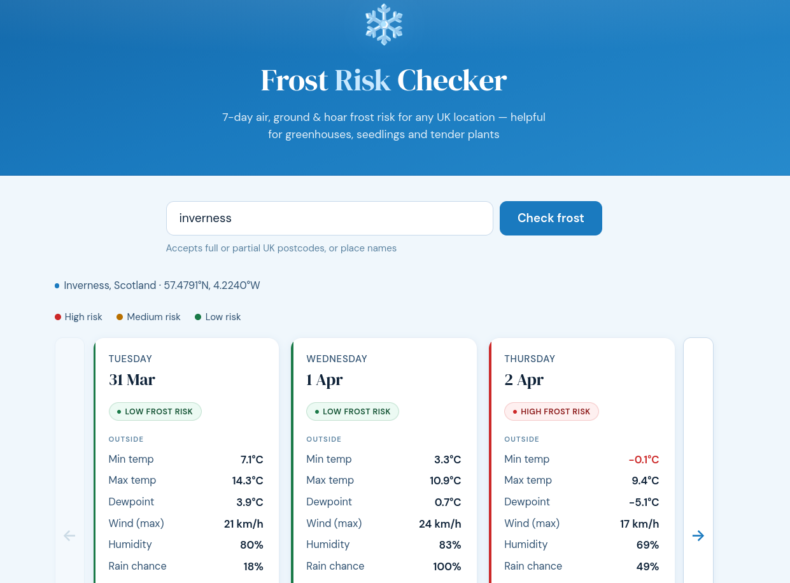

# ❄️ Frost Risk Checker

A single-file web app that gives you a 7-day air, ground and hoar frost risk forecast for any UK location. Built to help gardeners and growers protect seedlings and tender plants.

## Features

- **7-day forecast** with ← → navigation to step through the week one day at a time
- **Three frost types assessed independently:**
  - Air frost (air temp ≤ 0°C at 1.2 m)
  - Ground frost (ground surface reaches 0°C — can occur when air temp is still 2–3°C)
  - Hoar frost (ice crystal formation, based on dewpoint and wind speed)
- **Unheated greenhouse estimate** — wind-adjusted minimum temperature inside
- **UK postcode support** — full postcodes (NG16 4DE), partial/outward codes (NG16), or place names (Langley Mill, Matlock)
- **Colour-coded risk badges** — high / medium / low, consistent with all displayed values
- No installation, no server, no API key required — just open the HTML file in a browser

## Usage

No build step. No dependencies to install. Just open `frost-risk.html` in any modern browser.

If hosted (e.g. via GitHub Pages or Netlify), simply navigate to the URL.

## How it works

### Location lookup
- Full and partial UK postcodes are resolved via [postcodes.io](https://postcodes.io) — a free, open UK postcode API
- Place names are resolved via the [Open-Meteo Geocoding API](https://open-meteo.com/en/docs/geocoding-api), with UK results preferred

### Forecast data
Weather data is fetched from [Open-Meteo](https://open-meteo.com) — free, no API key, no rate limits for personal use. Fields used:

| Field | Use |
|---|---|
| `temperature_2m_min` | Air frost and ground frost assessment |
| `temperature_2m_max` | Display only |
| `windspeed_10m_max` | Ground frost suppression, hoar frost, greenhouse buffer |
| `relative_humidity_2m_mean` | Dewpoint calculation |
| `precipitation_probability_max` | Display only |

### Frost assessment logic

**Dewpoint** is calculated using the Magnus formula from minimum temperature and relative humidity.

**Air frost** — likely if min temp ≤ 0°C; possible if ≤ 1.5°C.

**Ground frost** — likely if min temp ≤ 3°C *and* wind < 8 km/h; possible if min temp ≤ 3°C regardless of wind.

**Hoar frost** — likely if dewpoint < 0°C *and* wind < 10 km/h; possible if dewpoint < 0.5°C *and* wind < 15 km/h.

**Overall risk score:**

| Condition | Score |
|---|---|
| Air frost (min ≤ 0°C) | +3 |
| Air frost possible (min ≤ 1.5°C) | +2 |
| Ground frost likely (else) | +1 |
| Ground frost likely | +1 |
| Hoar frost likely | +1 |

Score ≥ 3 → HIGH · Score ≥ 1 → MEDIUM · Score 0 → LOW

**Greenhouse buffer** is wind-adjusted:
- Wind > 20 km/h → +1.5°C
- Wind > 10 km/h → +2.5°C
- Wind ≤ 10 km/h → +3.5°C

## Data sources

| Source | Purpose | Cost |
|---|---|---|
| [Open-Meteo](https://open-meteo.com) | Weather forecast (ECMWF model) | Free |
| [postcodes.io](https://postcodes.io) | UK postcode geocoding | Free |
| [Open-Meteo Geocoding](https://open-meteo.com/en/docs/geocoding-api) | Place name lookup | Free |

No data is collected or stored. All API calls are made directly from your browser.

## Licence

MIT — do whatever you like with it. Attribution appreciated but not required.

---

*If this is useful, you can [buy me a coffee](https://www.buymeacoffee.com/johnhilltanner) ☕*
